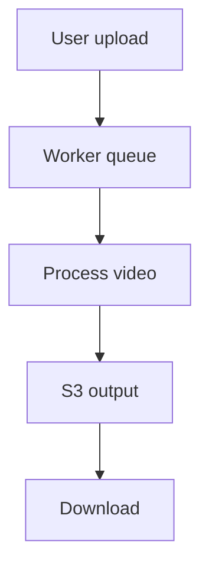

# Auto Audio-Describe



## Local development

```bash
docker-compose up -d
pnpm install
pnpm dev # from apps/web
```

## Packages
- apps/web – Next.js frontend
- packages/worker – processing worker
- packages/shared – shared types

## Environment variables
See `.env.example` for all required variables.
